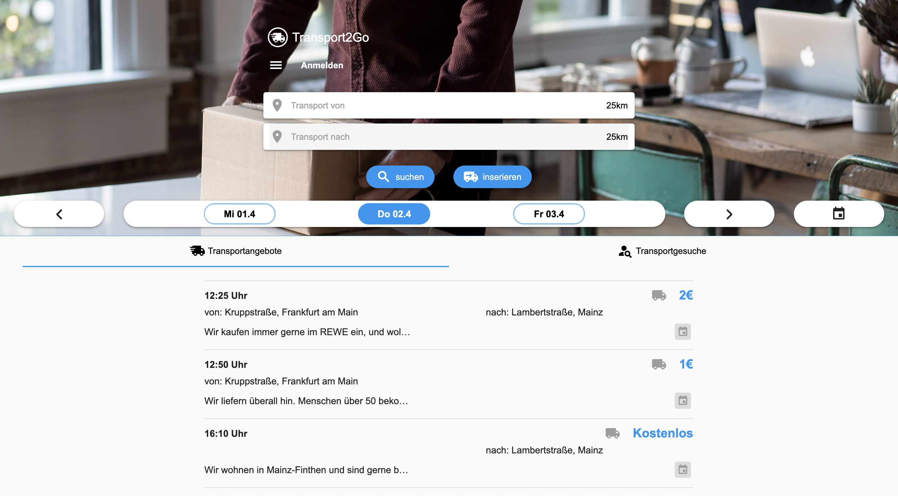
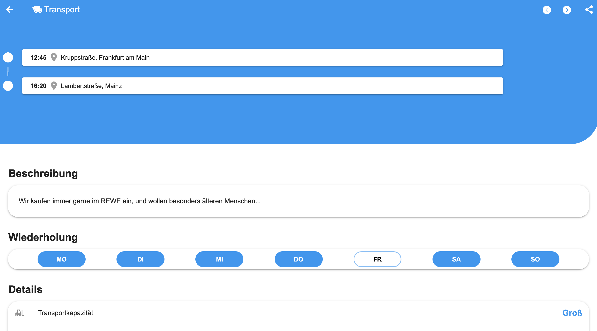
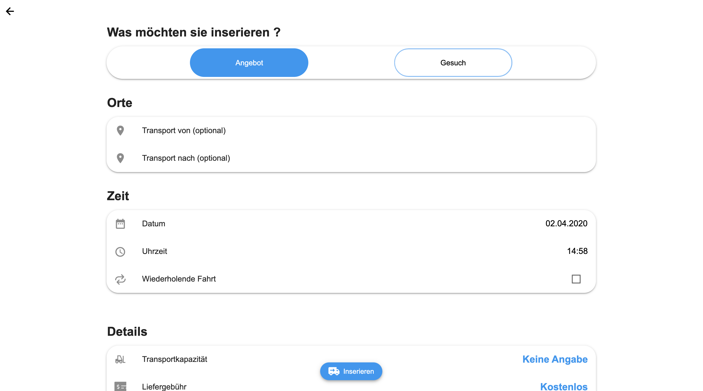
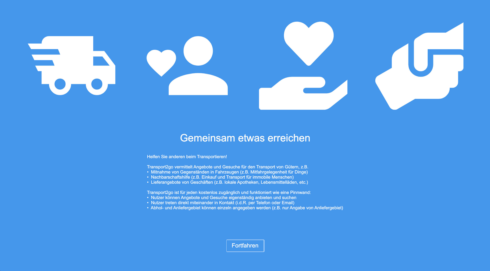

# Transport2Go Concept

This is a concept we've made with Flutter Web. 
Our target was to create a concept of a portal for transports and neighbourhood assistance.

## Setup

Get all dependencies

``flutter pub get``

That's it :D

## Run

Run debug app

``flutter run -d chrome``

Run release app 

``flutter run -d chrome --release``

Run release app with Skia build (WebAssembly)

``flutter run -d chrome --dart-define=FLUTTER_WEB_USE_SKIA=true --release``

## Screenshots

## About

We've built this concept with Flutter Web. A bit of logic is inside like SSO login and place search.

We would invite you to work with us on this concept and maybe build a working prototype in the future.

If you don't have any idea how to help, we have an issue board with open issues you can work on.

## License

Everything is licensed under [BSD-3-Clause](./LICENSE), so you are free to use it.

## Creator / Developer

Design & Code was completely made by [Tristan Marsell](https://github.com/PDesire).

For any questions, you can ask on this repo by opening a new issue or otherwise ask the creator.

**We hope you like our concept :D**

